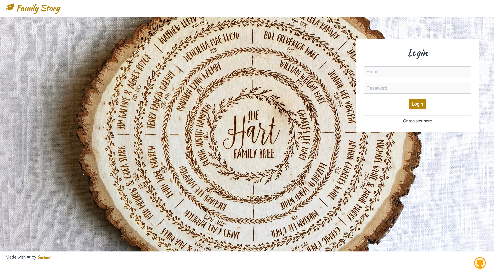
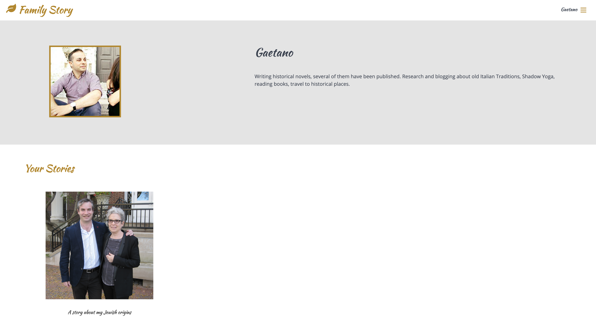
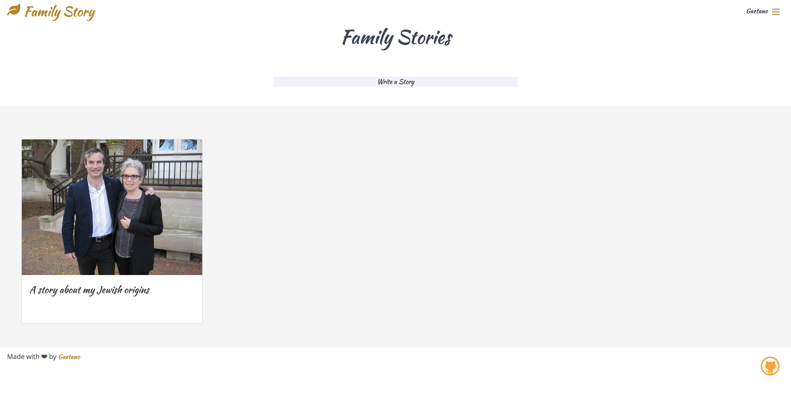
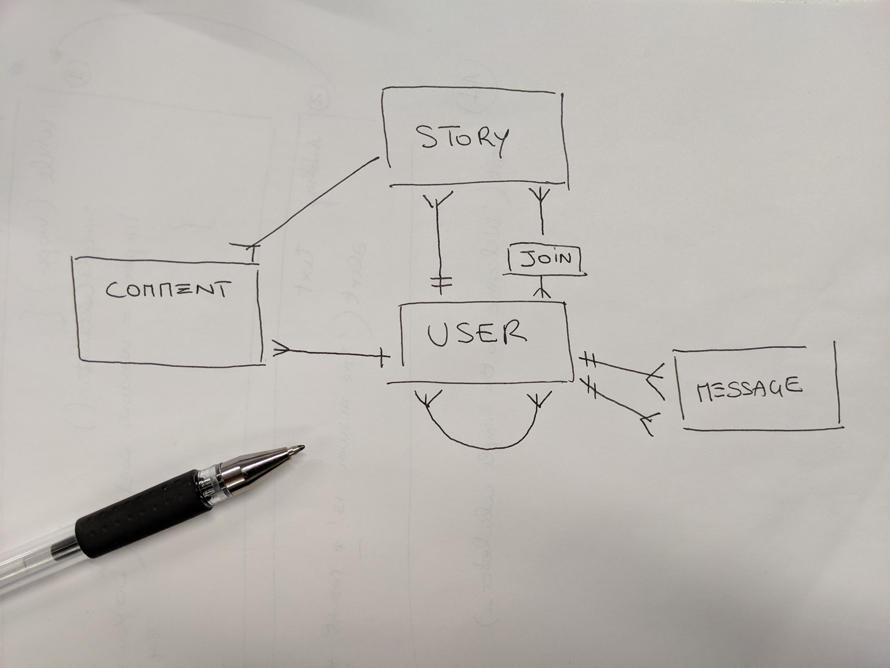

# SEI Project 4 - Family Story

Inspired by my interest in history and culture, I built Family Story, a web app for story lovers, which allows users to find short stories posted by other users and share their own post.

**<a href="https://family-story-ga.herokuapp.com" target="_blank">Visit the Website</a>**

### Timeframe & Team
> 7 days, solo

### The Brief
Create a full-stack app using Python and PostgreSQL on the server-side and React on the client-side. 

### Technologies
- React 
- Sass CSS 
- Spectre 
- ES6 JavaScript 
- Marshmallow 
- Flask
- Python 
- JWT 
- Axios 
- PostgreSQL 
- SQLAlchemy 
- Dotenv 
- bcrypt 
- Insomnia 
- Heroku

___

## Website Summary & Project Background

Family Story is a content creation site for authors and readers to share and discover new short stories about families and old traditions. The website allows authors and readers to connect and communicate through messages and comments

I wanted it to be a relatively simple idea so I could focus on ensuring the web app was made well, that it was visually appealing and responsive, error handling messages were working accurately and my code was clean. I realised that to build a complete social platform was a challenging task in just 7 days. So I decided that my MVP was a platform which allowed a user to register, post their stories, like and comment on the stories of others.

## Login

## Register

## Profile

## Stories Page

## Write a Story

## Process
The project started with an Entity Relationship Diagram (ERD) and I used Draw.io and Google Slides to wireframe. The site has a Python/PostgreSQL backend and a React frontend. Based on the initial technical design, I built the data models and used Flask to provide the API framework. Before building the front end, I tested the API endpoints using Insomnia and TablePlus.

I am proud of the code that I wrote to meet these initial objectives, and going forward with this project I will be looking to include filters for showing different types of posts, and then use a translation API to automatically adapt the stories to the reader’s language of choice. The back end was built using Python, Flask and PostgreSQL.

### Challenges and Wins
It was challenging to do the whole full-stack project myself in only one week, but also allowed me to get to know all parts of the process.

### Future Improvements
Next stage of developing Family Story would be adding private messages functionality.
Language translator to let the user choose the prefer reading reading language.

___

## Install

`brew install pipenv`

`pipenv install`

`yarn install`

### Initialize the PostgreSQL database

`yarn seed`

### Run the app

Start the backend server

`yarn serve:back`

Starts the frontend server

`yarn serve:front`

## Deploy

With heroku, automatically deploys from new code is pushed to `master`
