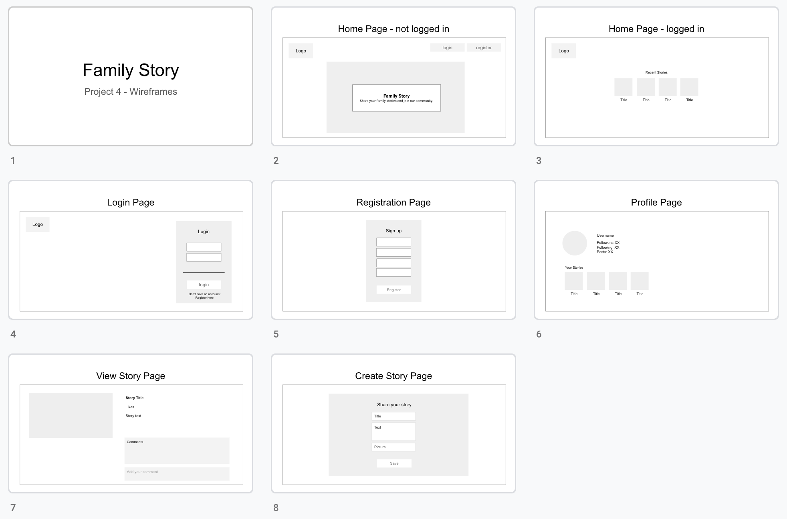

[](https://family-story-ga.herokuapp.com/)

# SEI Project 4 - Family Story

Inspired by my interest in history and culture, I built Family Story, a web app for story lovers, which allows users to find short stories posted by other users and share their own posts.

**<a href="https://family-story-ga.herokuapp.com" target="_blank">Visit the Website</a>**


### Timeframe & Team
> 7 days, solo

### Brief
Create a full-stack app using Python and PostgreSQL on the server-side and React on the client-side. 

### Tech Stack
- React 
- Sass CSS 
- Spectre 
- ES6 JavaScript 
- Marshmallow 
- Flask
- Python 
- JWT 
- Axios 
- PostgreSQL 
- SQLAlchemy 
- Dotenv 
- bcrypt 
- Insomnia 
- Heroku

___

## Website Summary & Project Background

Family Story is a content creation website for authors and readers to share and discover short stories about families and old traditions. The website allows authors and readers to connect and communicate through messages and comments

I wanted it to be a relatively simple idea so I could focus on ensuring the web app was made well, that it was visually appealing and responsive, error handling messages were working accurately and my code was clean. I realized that to build a complete social platform was a challenging task in just 7 days. So I decided that my MVP was a platform which allowed a user to register, post their stories, like and comment on the stories of others.

## Process
The project started with an ``Entity Relationship Diagram (ERD)`` and I used Draw.io and Google Slides to prepare some initial wireframes.



Family Story has a ``Python/PostgreSQL`` backend and a ``React`` frontend. Based on the initial technical design, I built the data models and used Flask to provide the API framework. Before building the front end, I tested the API endpoints using Insomnia and TablePlus.


I am proud of the code that I wrote to meet these initial objectives, and going forward with this project I will be looking to include filters for showing different types of posts, and then use a translation API to automatically adapt the stories to the reader’s language of choice. The back end was built using Python, Flask and PostgreSQL.

### Challenges and Wins
It was challenging to do the whole full-stack project myself in only one week, but also allowed me to get to know all parts of the process.

## Key Learnings

This was a solo project, so I had to overcome many obstacles and challenges independently. I had to plan the application from the beginning, creating user stories and wireframes, ERD diagrams, and plan database tables.

I have learned how to create a simple full-stack Flask/React web application, interacting with a PostgreSQL database in a secure manner and Implementing Login and Register functionalities in Python.

___

# Website visuals

## Login


## Register


## Profile


## Stories Page


## Write a Story


___

## Install

`brew install pipenv`

`pipenv install`

`yarn install`

### Initialize the PostgreSQL database

`yarn seed`

### Run the app

Start the backend server

`yarn serve:back`

Starts the frontend server

`yarn serve:front`

## Deploy

With heroku, automatically deploys from new code is pushed to `master`


---

# Interesting code snippets

## Authentication

Firstly we get the Authorization header from the request and extract the token from it. Then we attempt to decode the token. If successful, we attempt to find the user by the sub property in the token's payload, the user's ID. If the user is found we add it to Flask's g module.


### Authentication Backend

```python
from flask import Blueprint, jsonify, request, g
from models.user import User, UserSchema
from lib.secure_route import secure_route

api = Blueprint('auth', __name__)
user_schema = UserSchema()

# == REGISTER ===
@api.route('/register', methods=['POST'])
def register():
    data = request.get_json()
    user, errors = user_schema.load(data)
    if errors:
        return jsonify(errors), 422
    user.save()
    return jsonify({'message': 'Registration Successful'}), 201

# === LOGIN ===
@api.route('/login', methods=['POST'])
def login():
    data = request.get_json()
    if not data:
        return jsonify({'message': 'Unauthorized'}), 401
    user = User.query.filter_by(email=data['email']).first()
    if not user or not user.validate_password(data['password']):
        return jsonify({'message': 'Unauthorized'}), 401
    return jsonify({
        'token': user.generate_token(),
        'message': f'Welcome back {user.username}'
    }), 200

# ===   current user profile ===
@api.route('/profile', methods=['GET'])
@secure_route
def profile():
    return user_schema.jsonify(g.current_user), 200
```

### Authentication Frontend

```javascript
class Auth {
  static setToken(token) {
    localStorage.setItem('token', token)
  }

  static getToken() {
    return localStorage.getItem('token')
  }

  static logout() {
    localStorage.removeItem('token')
  }

  static getPayload() {
    const token = this.getToken()
    if (!token) return false
    const parts = token.split('.')
    if (parts.length < 3) return false
    return JSON.parse(atob(parts[1]))
  }

  static isAuthenticated() {
    const payload = this.getPayload()
    const now = Math.round(Date.now() / 1000)
    return now < payload.exp
  }
}
```


## User Schema

In the ``user.py`` file I have defined the schema for the user entity, using SQLAlchemy. This allows defining a map between Python entities and the database tables.

It is also possible to define fields types, validation methods and error conditions for the forms. The relationships with the other entities are also defined, for example, the connection with the Stories that belongs to the User object.

```python
from datetime import datetime, timedelta
import jwt
from sqlalchemy.ext.hybrid import hybrid_property
from marshmallow import validates_schema, fields, ValidationError, validate
from app import db, ma, bcrypt
from config.environment import secret
from .base import BaseModel, BaseSchema


class User(db.Model, BaseModel):

    __tablename__ = 'users'

    id = db.Column(db.Integer, primary_key=True)
    username = db.Column(db.String(20), nullable=False, unique=True)
    email = db.Column(db.String(128), nullable=True, unique=True)
    password_hash = db.Column(db.String(128), nullable=True)
    image_url = db.Column(db.String(256), nullable=False)
    bio = db.Column(db.String(512), nullable=False)

    @hybrid_property
    def password(self):
        pass

    @password.setter
    def password(self, plaintext):
        self.password_hash = bcrypt.generate_password_hash(
            plaintext).decode('utf-8')

    def validate_password(self, plaintext):
        return bcrypt.check_password_hash(self.password_hash, plaintext)

    def generate_token(self):
        payload = {
            'exp': datetime.utcnow() + timedelta(days=1),
            'iat': datetime.utcnow(),
            'sub': self.id
        }

        token = jwt.encode(
            payload,
            secret,
            'HS256'
        ).decode('utf-8')

        return token


class UserSchema(ma.ModelSchema, BaseSchema):

    email = fields.Email(required=True)

    @validates_schema
    # pylint: disable=R0201
    def check_passwords_match(self, data):
        if data.get('password') != data.get('password_confirmation'):
            raise ValidationError(
                'Passwords do not match',
                'password_confirmation'
            )

    # todo: add checks to prevent inserting duplicate usernames

    password = fields.String(required=True)
    password_confirmation = fields.String(required=True)

    image_url = fields.String(required=True)
    bio = fields.String(required=True)

    created_stories = fields.Nested(
        'StorySchema', many=True, only=('name', 'id'))

    class Meta:
        model = User
        exclude = ('password_hash', )
```

## Future Improvements

The next stage of this project would be adding these features, for example:
 * Private a messages functionality, like I did in the group project [Vietgram](https://github.com/gaebar/vietgram).
 * A more mobile friendly layout.
 * Language translator to let the user choose the prefer reading reading language.
 * A night mode, based on the latest browsers API, which allow to determine whether the user has chosen a dark for their OS.